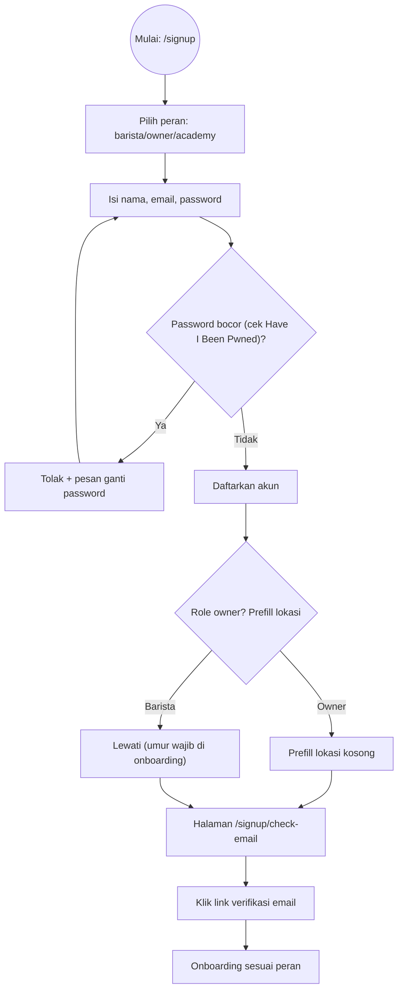
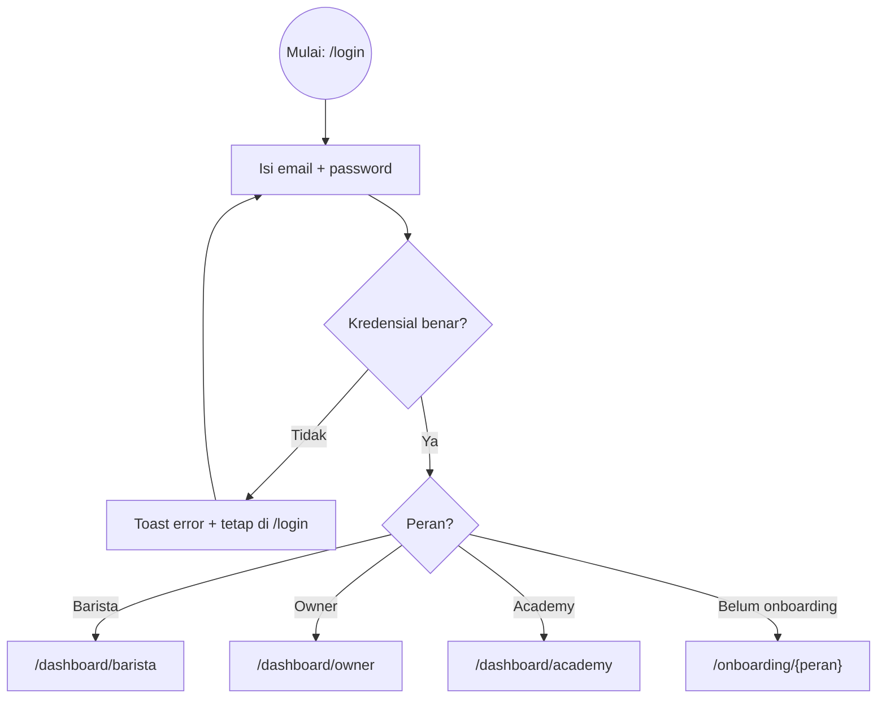
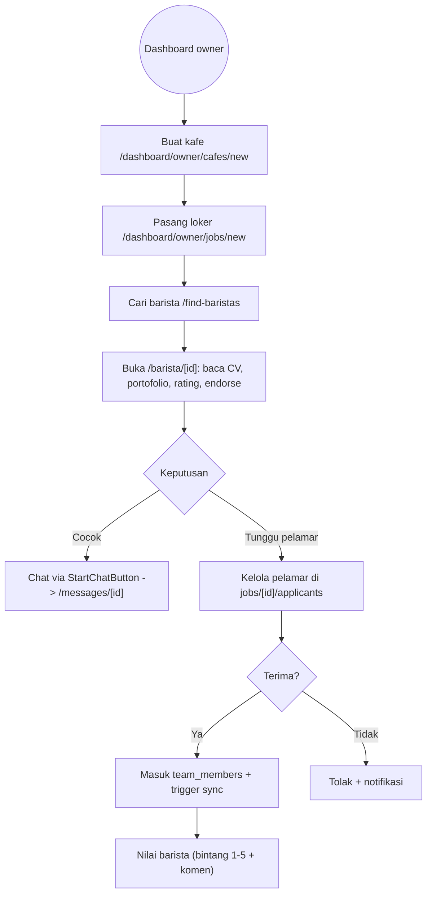

# BaristaConnect — Dokumen Konsultan

Tanggal: 2026-10-06 | Versi aplikasi: main pasca commit eb9d806 | Lingkungan: Next.js + Supabase + Vercel (live: https://barista-connect.vercel.app)

## 1. Ringkasan Eksekutif

BaristaConnect adalah platform yang mempertemukan barista (pencari dan pekerja kopi) dengan pemilik kedai kopi, dilengkapi modul akademi pelatihan. Posisi produk ini setara LinkedIn yang dikhususkan untuk industri kopi: profil profesional barista (portofolio foto, Curriculum Vitae, endorsement keahlian), jaringan koneksi antar profesional, feed publik, serta modul hiring yang lengkap bagi pemilik kedai (pemasangan lowongan, pengelolaan pelamar, pengelolaan tim, pesan, dan penilaian dua arah).

Status implementasi pada saat dokumen ini disusun:

| Area | Status | Bukti |
|---|---|---|
| Profil barista — portofolio foto | Selesai, migrasi database diterapkan | Tabel barista_portfolio + bucket penyimpanan 10 MB |
| Profil barista — pratinjau Curriculum Vitae | Selesai | Pratinjau PDF + unggah/penggantian PDF 5 MB |
| Fitur sosial — endorsement, koneksi, feed | Selesai, migrasi diterapkan | Tabel barista_endorsements, barista_connections, barista_posts + bucket feed-posts 10 MB |
| Tautan feed pada navigasi | Selesai, terverifikasi di lingkungan live | Tautan Feed pada header seluruh peran + banner pada dashboard owner |
| Build aplikasi | Hijau dan stabil | Konfigurasi turbopack.root + hasil build Compiled successfully |
| Audit sisi owner (10 halaman) | Lulus | Seluruh halaman HTTP 200, tidak ditemukan kerusakan |
| Audit sisi barista | Lulus dengan catatan | Halaman publik 200, pengalihan login berfungsi; verifikasi visual dalam keadaan login memerlukan browser fisik |
| Batas unggah berkas | Disesuaikan | Avatar 5 MB, portofolio dan feed 10 MB, kompresi otomatis oleh aplikasi |

## 2. Peran dan Kewenangan

| Peran | Definisi | Kewenangan | Batasan | Contoh alur |
|---|---|---|---|---|
| Barista | Pencari atau pekerja kopi | Melengkapi profil, mengunggah portofolio dan Curriculum Vitae, melamar lowongan, berkirim pesan, memberi endorsement, memposting feed, menerima atau menolak koneksi | Tidak dapat melihat data pemilik lain, mengubah lowongan, atau memproses pelamar | Seorang barista melamar lowongan di /jobs, kemudian memantau status lamaran di /dashboard/barista/applications |
| Owner (pemilik) | Pemilik kedai kopi | Membuat data kafe, memasang lowongan, melihat pelamar, menerima atau menolak pelamar, mengelola tim, menilai barista, berkirim pesan, memberi endorsement keahlian | Tidak dapat melihat data owner lain (isolasi data diperketat melalui migrasi penguatan otorisasi) | Seorang owner memasang lowongan di /dashboard/owner/jobs/new, kemudian memproses pelamar di halaman applicants |
| Manager | Pengelola yang diundang owner | Mengelola kafe dan lowongan dalam lingkup organisasi yang diberikan | Tidak dapat mengambil alih kepemilikan; lingkup kewenangan tidak dapat dikosongkan sendiri (dibatasi oleh guard basis data) | Seorang manager menerima undangan melalui token, kemudian mengelola lowongan dalam lingkupnya |
| Academy (akademi) | Penyelenggara pelatihan | Mengelola profil lembaga dan program pelatihan | Tidak mengikuti alur hiring barista maupun owner | Pengelola akademi mengatur profil di /dashboard/academy/profile |
| Anonim (belum login) | Pengunjung umum | Melihat halaman publik: beranda, /jobs, /barista/[id], /feed, /cafes/[id] | Melamar, chat, endorsement, koneksi, dan posting mewajibkan login terlebih dahulu | Pengunjung membuka /barista/[id], menekan Masuk untuk Menghubungi, lalu diarahkan ke /login?next=/barista/[id] |

## 3. Alur Autentikasi Lengkap (Sukses dan Gagal)

### 3.1 Pendaftaran (Signup)

Skenario kegagalan yang ditangani: password yang bocor (ditolak disertai pesan), email yang sudah terdaftar (pesan penolakan), tautan verifikasi kedaluwarsa (permintaan kirim ulang). Terdapat satu bug terbuka: alur verifikasi email pada akun Gmail tertentu dapat terlewati — tercatat sebagai temuan dan belum diperbaiki.

### 3.2 Masuk (Login)

Catatan implementasi: tombol intip password ganda yang sempat membingungkan telah dihapus — umpan balik login hanya melalui toast. Query profil menggunakan maybeSingle agar tidak menghasilkan error 406 ketika baris profil belum ada.

### 3.3 Lupa Password dan Ganti Password

Alur: /forgot-password (memasukkan email, pengiriman tautan reset) dilanjutkan /update-password (memasukkan password baru, konfirmasi, simpan). Kegagalan yang ditangani: email tidak terdaftar (pesan netral, tanpa membocorkan daftar email), tautan kedaluwarsa (permintaan kirim ulang), konfirmasi tidak cocok (pesan kesalahan dan fokus kembali ke kolom isian).

## 4. Onboarding per Peran

| Peran | Halaman | Wajib diisi | Hasil |
|---|---|---|---|
| Barista | /onboarding/barista | Nama, umur, keahlian, foto | Baris barista_profiles terbentuk beserta profil publik |
| Owner | /onboarding/owner | Nama usaha, lokasi | Baris owners terbentuk beserta organisasi personal otomatis |
| Academy | /onboarding/academy | Nama lembaga, deskripsi | Baris academy_profiles terbentuk |

Skenario: pengguna yang sudah login tetapi belum menyelesaikan onboarding diarahkan ke /onboarding/{peran}, bukan ke dashboard. Dashboard baru dapat diakses setelah onboarding selesai.

## 5. Profil Barista

Halaman: /dashboard/barista/profile (milik sendiri, mode edit via ?edit=1) dan /barista/[id] (publik dan untuk keperluan hiring oleh owner — read-only disertai aksi hiring).

| Fitur | Lokasi | Aturan | Contoh |
|---|---|---|---|
| Data diri dan foto | Editor profil | Avatar maksimal 5 MB, kompresi otomatis | Penggantian foto, nama, keahlian, sertifikat |
| Portofolio foto | Editor profil, tampil di profil | Maksimal 9 foto, tiap berkas maksimal 10 MB, caption maksimal 140 karakter, tersimpan saat kursor keluar, penghapusan optimistis dengan rollback bila gagal | Foto latte art beserta caption Latte art rosella |
| Curriculum Vitae | Pratinjau di profil, unggah di editor | PDF maksimal 5 MB ke bucket cvs, pratinjau iframe beserta tombol buka tab baru dan unduh | Owner membaca Curriculum Vitae sebelum memanggil wawancara |
| Endorsement keahlian | Bawah seksi keahlian, hanya untuk viewer login selain pemilik | Satu viewer satu suara per keahlian, dapat dibatalkan | Owner menekan Endorse pada keahlian Seduh Manual |
| Koneksi | Tombol di header profil dan kotak masuk di dashboard | Alur pending kemudian accepted, kedua pihak dapat memutus | Barista A mengirim permintaan, Barista B menerima di kotak masuk koneksi |
| Riwayat kerja | Berasal dari team_members | Tercatat otomatis saat diterima, ditandai saat terminated | Pengalaman 3 tahun di dua kafe tampil otomatis |
| Rating | Berasal dari ratings, rata-rata publik hanya mencakup ulasan visible | Dapat diubah seminggu sekali; fitur Shield dapat menyembunyikan maksimal 30 persen | Rating 4,0 dari 1 ulasan |

## 6. Sisi Owner — Alur Hiring

Skenario per tahap:

| Tahap | Sukses | Gagal atau edge |
|---|---|---|
| Pasang lowongan | Lowongan tampil di /jobs dan dashboard | Validasi kosong ditolak disertai toast; penghapusan lowongan via tombol hapus, data tim tetap tercatat |
| Lamar (sisi barista) | Lamaran masuk dan counter diperbarui | Profil belum lengkap (nama/foto) memicu notice; lamaran tanpa cover memicu toast dan fokus |
| Terima | Status diterima, baris tim tercatat, chat terbuka, tombol WhatsApp tersedia | Login dengan akun owner yang salah menampilkan EmptyState yang jelas di halaman applicants, bukan error 404 |
| Kelola tim | Satu baris per orang beserta sub-baris per lowongan; Keluarkan menandai terminated; capaian dihitung dari terminated | Penghapusan anggota via tombol hapus; anggota terminated tampil terpisah |
| Rating dua arah | Kedua pihak saling menilai, rata-rata publik hanya mencakup yang visible | Fitur Shield memungkinkan pihak yang dinilai menyembunyikan maksimal 30 persen; gerbang langganan masih manual (Midtrans menunggu go-live) |

## 7. Feed Publik

Halaman /feed merupakan feed publik dengan konteks profesional. Posting berisi foto opsional (maksimal 10 MB, kompresi otomatis) dan caption maksimal 500 karakter. Publik dapat membaca tanpa login; hanya barista yang login yang dapat memposting. Feed ditautkan pada header seluruh peran dan banner dashboard owner. Daftar menampilkan 30 postingan terbaru dengan ISR 30 detik.

Skenario: ketika belum ada postingan, empty state publik tampil (bukan error). Kegagalan unggah (berkas terlalu besar atau tipe salah) menampilkan pesan dan rollback tanpa menyisakan baris sampah.

## 8. Organisasi, Transfer, Keamanan

| Topik | Isi | Status |
|---|---|---|
| Organisasi | Personal (solo) versus company; manager multi-organisasi beserta audit org_audit; undangan via token; revoke tersedia | Selesai |
| Transfer owner | Owner lama turun menjadi manager, owner baru menjadi member-owner, tercatat dalam audit owner_transfer; round-trip teruji | Selesai dan terverifikasi |
| Isolasi data | Otorisasi can_manage_cafe diperketat (member-required); org_member_list fail-closed | Selesai |
| Audit keamanan | IDOR nihil, cross-owner read nol, anon sensitif nol, PATCH/DELETE victim nol baris | Lulus |
| Halaman publik versus privat | Publik via view baristas_public/owners_public; centang biru dan rating hidden hanya via RPC berhak | Selesai |

## 9. Batasan yang Masih Terbuka

1. Bug pendaftaran: verifikasi email pada akun Gmail tertentu dapat terlewati — belum diperbaiki.
2. Monetisasi Midtrans menunggu pendaftaran dan konfigurasi kunci di Vercel; gerbang langganan masih manual.
3. Verifikasi visual mode edit profil dan messages dalam keadaan login barista membutuhkan browser fisik.

## 10. Langkah Berikutnya yang Disarankan

1. Perbaiki bug verifikasi Gmail pada alur pendaftaran.
2. Go-live Midtrans untuk fitur centang biru dan Shield.
3. Verifikasi visual login barista via browser serta uji toggle Shield end-to-end.
4. Dokumen ini dibaca dari Desktop, kemudian diimpor ke Notion untuk klien.
