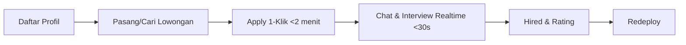

# Barista Connect — Client Presentation

> Website only. No mobile app. No POS. Deploy di Vercel + Supabase.

## 1. Blueprint (Arsitektur)

**Stack:** Next.js 16 App Router, React 19, Tailwind v4, Supabase (Auth/DB/Realtime), AI Gateway (Groq/NVIDIA), Vercel

| Layer | Tech | Fungsi |
|---|---|---|
| Frontend | Next.js 16 + Tailwind | Daftar profil, lowongan, apply 1-klik |
| Backend | Supabase Postgres + RLS | User, Shop, Job, Application, Chat |
| Realtime | Supabase Realtime | Chat <30 detik, notif apply |
| Auth | Supabase Auth | Email/pass, role barista/shop |
| AI | AI Gateway | Embeddings + chat helper |
| Deploy | Vercel | CI/CD, domains |

**Workflow Utama:**

**Data Flow:**
`Barista → Application → Shop → Chat → Hired → Rating`

## 2. Roadmap 6 Minggu

| Minggu | Fase | Deliverable | KPI |
|---|---|---|---|
| 1 | Foundation | Auth, profil barista/shop, DB schema | 100% RLS pass |
| 2 | Jobs | CRUD lowongan, search/filter, apply 1-klik | Apply <2m |
| 3 | Chat | Realtime chat, interview slot | Chat <30s |
| 4 | Rating & Admin | Hired, rating, dashboard | Hire flow E2E |
| 5 | Payment Prep | Stripe checkout Starter (opsional), landing | Checkout mock |
| 6 | Polish & Launch | QA, performa, deploy prod, handover | Lighthouse >90 |

**Gantt Simplified:**
`M1 ████ | M2 ████ | M3 ████ | M4 ████ | M5 ████ | M6 ████`

## 3. Backlog Prioritas (MoSCoW)

| ID | Fitur | Prioritas | Estimasi |
|---|---|---|---|
| B-01 | Daftar + profil barista | Must | 2d |
| B-02 | Profil kedai + pasang lowongan | Must | 2d |
| B-03 | Browse + filter lowongan | Must | 2d |
| B-04 | Apply 1-klik | Must | 1d |
| B-05 | Chat realtime | Must | 3d |
| B-06 | Hired + rating | Must | 2d |
| B-07 | Dashboard shop (kelola pelamar) | Should | 2d |
| B-08 | Landing + SEO | Should | 1d |
| B-09 | Stripe Starter | Could | 2d |
| B-10 | Analytics + admin | Could | 2d |
| B-11 | POS / Mobile App | Won't | - |

## 4. Sprint Plan (2-week sprints)

### Sprint 1 (M1-M2): Foundation + Jobs
| Task | Owner | Status |
|---|---|---|
| Schema Supabase + RLS | BE | Todo |
| Auth + profil | FE/BE | Todo |
| Job CRUD + apply | FE/BE | Todo |
| Search/filter | FE | Todo |
| QA Sprint 1 | QA | Todo |

### Sprint 2 (M3-M4): Chat + Hired
| Task | Owner | Status |
|---|---|---|
| Realtime chat | BE | Todo |
| Interview slot | FE | Todo |
| Hired & rating | FE/BE | Todo |
| Dashboard | FE | Todo |

### Sprint 3 (M5-M6): Launch
| Task | Owner | Status |
|---|---|---|
| Landing polish | FE | Todo |
| Stripe mock | BE | Todo |
| Perf + QA | QA | Todo |
| Deploy + training | PM | Todo |

**Workflow Sprint:**
`Backlog → Sprint Planning → Dev → QA → Demo Client → Deploy`

---
*File ini auto-sync ke LLM Wiki. Index: embed via `gemini-embedding-001`.*
