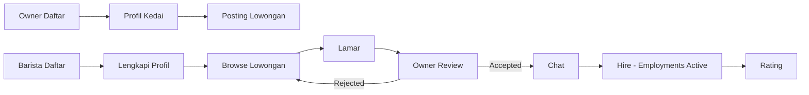

# Barista Connect -- Panduan Lengkap (Website Only)

> **Versi:** 3.1 Website Only | **Tanggal:** 2026-09-06 | **Status:** WEBSITE ONLY (Tanpa Mobile App, Tanpa POS)
> **Sumber:** `tutorial-barista-connect.md` (REAL - Marketplace lowongan)
> **Manual POS DIHAPUS sesuai request** -- kasir/stok/tutup buku/shift/laporan tidak dibahas.

---

## 0. Cara Pakai

Dokumen ini adalah **satu-satunya sumber kebenaran**.
- `tutorial-barista-connect.md` + `manual-penjualan-barista-connect.md` sudah digabung ke sini.
- Bagian POS/stok/laporan **telah dihapus** karena tidak dibutuhkan (website marketplace saja).

---

## 1. Apa Itu Barista Connect (Website Only)

**Marketplace lowongan khusus barista.** Bukan POS, bukan ERP.

- **Barista:** daftar -> lengkapi profil -> cari lowongan -> lamar -> chat -> di-hire -> dapat rating
- **Owner:** daftar -> posting lowongan -> review pelamar -> chat -> hire/terminate -> kasih rating

Satu website Next.js + Supabase, responsive di HP tanpa perlu bikin APK.

**Tagline:** *Cari barista tanpa drama -- semua di website.*

---

## 2. Peran & Alur Website

| Peran | Bisa Apa | Tidak Bisa |
|---|---|---|
| **Barista** | Daftar, profil, browse jobs, lamar, chat, lihat status, rating | Buat lowongan, hire orang |
| **Owner** | Daftar, buat/edit lowongan, lihat pelamar, chat, hire/terminate, rating | Lamar kerja |
| **Admin** | Moderasi (opsional) | -- |

---

## 3. Workflow Lengkap (4 Fase -- Simple, Tidak Ribet)

| Fase | Path Halaman | Alur | Tabel DB | Status |
|---|---|---|---|---|
| **A. Profil** | `app/(dashboard)/barista/profile`   `app/(dashboard)/owner/profile` | Barista: isi display_name, avatar, bio, skills, experience   Owner: isi shop_name, location, description | `barista_profiles`, `owner_profiles` -> `auth.users` | Wajib isi sebelum lamar/posting |
| **B. Lowongan & Lamaran** | `app/jobs` (browse)   `/owner/jobs/new` (posting)   `/owner/applications` (review) | Owner posting -> `jobs.status = open`   Barista browse `/jobs` -> Apply -> `applications.status = pending`   Owner review -> `accepted` / `rejected` | `jobs`, `applications` | `pending` -> `accepted` -> `hired` |
| **C. Chat & Hiring** | `components/chat`   `app/(dashboard)/employments` | Chat: `chat_threads` + `messages` (Realtime)   Hire: `employments.status = active`, lowongan -> `hired/closed`   Terminate: -> `terminated` | `chat_threads`, `messages`, `employments` | `active` / `terminated` |
| **D. Rating** | `app/ratings` | Setelah kerja selesai, kedua pihak rating 1-5 + komentar | `ratings` | `stars` 1-5 |

---

## 4. Tabel DB (Hanya Ini -- Jangan Tambah POS)

| Tabel | Kolom Penting | Relasi | Keterangan |
|---|---|---|---|
| `auth.users` | `id`, `email` | Supabase Auth | Sumber user utama |
| `barista_profiles` | `user_id`, `display_name`, `avatar`, `bio`, `skills[]`, `experience` | -> `auth.users.id` | 1 barista = 1 profil |
| `owner_profiles` | `user_id`, `shop_name`, `location`, `description` | -> `auth.users.id` | 1 owner = 1 kedai |
| `jobs` | `owner_id`, `title`, `description`, `status` | -> `owner_profiles` | `open \| hired \| closed` |
| `applications` | `job_id`, `barista_id`, `status`, `cover_letter` | -> `jobs`, `barista_profiles` | `pending \| accepted \| rejected` |
| `employments` | `job_id`, `barista_id`, `owner_id`, `status` | -> `jobs` | `active \| terminated` |
| `chat_threads` | `barista_id`, `owner_id`, `job_id` | -> `jobs` | 1 thread per lamaran |
| `messages` | `thread_id`, `sender_id`, `body`, `created_at` | -> `chat_threads` | Realtime Supabase |
| `ratings` | `employment_id`, `rater_id`, `ratee_id`, `stars`, `comment` | -> `employments` | `stars` 1-5 |

> **JANGAN BIKIN:** `products` / `stock_ledger` / `transactions` / `cash_closing` / `shifts` -- tidak dibutuhkan.

---

## 5. Diagram Website

---

## 6. Paket Penjualan (Hanya Marketplace)

| Paket | Isi | Harga Saran |
|---|---|---|
| **STARTER** | Website marketplace full (profil, lowongan, lamaran, chat, hire, rating) + hosting | Rp 1,5 - 3 jt setup + 99rb/bulan |

> Fokus satu masalah dulu biar cepat jadi dan murah.

**Script jualan:**
> "Pak, Barista Connect itu website untuk cari barista. Posting lowongan, barista lamar lewat website, chat dan rekrut langsung di situ."

---

## 7. Objection Handling

| Tanya | Jawab |
|---|---|
| "Kok gak ada aplikasi HP?" | "Website responsive, buka di HP kayak aplikasi. Bisa Add to Home Screen tanpa APK." |
| "Barista resign?" | "Owner klik Terminate, lowongan buka lagi. Rating tetap." |
| "Butuh kasir?" | "Tidak ada di paket ini, ini khusus rekrutmen." |

---

## 8. Script Demo 5 Menit

0-1m: Masalah cari barista susah
1-3m: Jadi Barista -> daftar -> lamar
3-4.5m: Jadi Owner -> review -> chat -> Hire
4.5-5m: Tunjukkan employments & rating -> "Mau coba posting lowongan?"

---

## 9. Checklist Coding (Biar Gak Ribet)

**WAJIB:**
- [ ] Auth Supabase (role barista/owner)
- [ ] barista_profiles & owner_profiles + RLS
- [ ] CRUD jobs + browse/filter
- [ ] applications (lamar)
- [ ] chat_threads + messages (Realtime simple)
- [ ] employments (hire/terminate)
- [ ] ratings
- [ ] Responsive Tailwind, deploy Vercel

**JANGAN:**
- [ ] POS, stok, kasir
- [ ] Mobile app
- [ ] Printer/barcode
- [ ] Laporan omzet

---

## 10. Roadmap Simple

| Minggu | Fokus |
|---|---|
| 1-2 | Auth + Profil |
| 3-4 | Lowongan & Lamaran |
| 5 | Chat & Hire |
| 6 | Rating & Polish -> LAUNCH |

Selesai. Website only.

> Next: Polish Fase 1, deploy, jualan STARTER ke 3 kedai.
