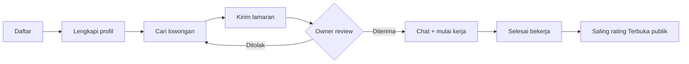
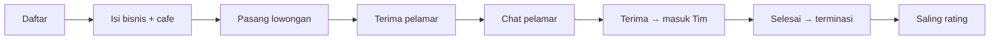
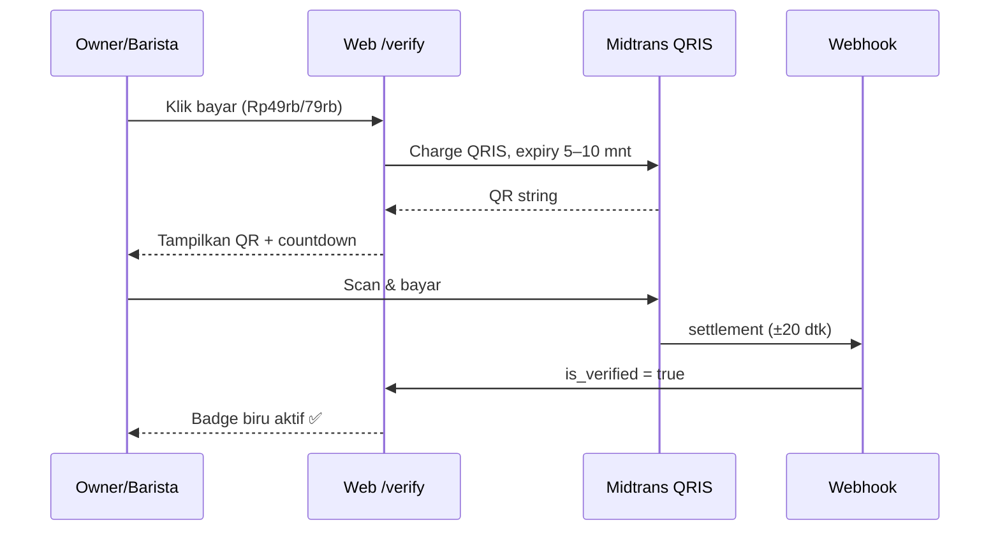

# BaristaConnect — Project Overview

> Dokumen ini ditulis gaya Project Manager: status, fitur, alur, dan roadmap dalam satu tempat.
> Update terakhir: 13 Sep 2026 · Live: `barista-connect.vercel.app` · Repo: `ArjunaSinaga/barista-connect` (branch `main`)

## 1. Ringkasan Eksekutif

| Item | Isi |
|---|---|
| **Produk** | Platform lowongan kerja khusus barista ↔ coffee shop (Indonesia) |
| **Tagline** | "Seduh kariermu. Temukan shift-mu." |
| **Masalah** | Info loker barista tersebar di WA/IG story, tidak transparan (gaji, tipe kerja) |
| **Solusi** | Loker transparan + profil sekali jadi + lamaran + chat + rating dua arah |
| **Status** | 🟢 Live & bisa dipakai umum (daftar barista/owner normal) |
| **Biaya infra** | ~Rp0 (tier gratis Vercel + Supabase) |

## 2. Tech Stack

| Lapisan | Teknologi | Keterangan |
|---|---|---|
| Frontend | Next.js 16 (App Router) + Tailwind | Server Components, deploy Vercel |
| Backend | Next.js Route Handlers + Supabase Postgres | RLS aktif di semua tabel bisnis |
| Auth | Supabase Auth | Email + password, 2 role |
| Storage | Supabase Storage | Bucket `cvs`, `cafes`, foto profil |
| AI | NVIDIA Nemotron + fallback (Groq, Cerebras, Gemini, Bytez) | Auto-reply chat, suggest balasan, caption |
| Payment | Midtrans QRIS (kode DONE, **OFF / belum go-live**) | Butuh Server Key + Service Role Key di Vercel env |

## 3. Peran Pengguna

| | 🧑‍🍳 Barista | 🏪 Owner |
|---|---|---|
| Tujuan | Cari & lamar shift | Pasang loker & rekrut |
| Onboarding | 1 langkah (foto + nama) | Data bisnis + tambah cafe |
| Dashboard | Ringkasan lamaran + feed loker | Performa rekrutmen + daftar loker |
| Profil saya | View publik + edit (`?edit=1`) | View bisnis + edit (`?edit=1`) |
| Aksi utama | Lamar, chat, nilai cafe (setelah selesai) | Review pelamar, terima/tolak, chat, nilai barista, kelola tim |
| Fitur sosial | Riwayat kerja, skill, sertifikat, rating | Daftar cafe, rating dari barista |

## 4. Peta Fitur & Status

| # | Fitur | Status | Catatan |
|---|---|---|---|
| 1 | Landing + statistik live | ✅ Live | Jujur, tanpa klaim palsu |
| 2 | Signup/Login 2 role + cek password bocor (HIBP k-anonymity) | ✅ Live | |
| 3 | Onboarding barista ramping (foto+nama) | ✅ Live | User tolak deteksi wajah |
| 4 | CRUD Cafe + foto wajib | ✅ Live | Multi-cafe per owner |
| 5 | Pasang/edit/hapus lowongan | ✅ Live | |
| 6 | Lamar + CV/cover/WA | ✅ Live | |
| 7 | Chat owner↔barista + hapus pesan/room | ✅ Live | + AI auto-reply |
| 8 | Rating dua arah + blind review | ✅ Live | Baru tampil setelah saling menilai |
| 9 | Tim permanen + resign + riwayat kerja | ✅ Live | Trigger sync otomatis |
| 10 | Profil publik `/barista/[id]`, `/owner/[id]`, `/cafes/[id]` | ✅ Live | |
| 11 | Profil Saya (view mode + banner privat) | ✅ Live | Komponen share view |
| 12 | Navbar: ikon→landing, tulisan→dashboard, link Profil | ✅ Live | |
| 13 | Dashboard stat berwarna per status | ✅ Live | |
| 14 | Centang biru berbayar (QRIS) | ⏸️ **OFF — kode jadi, disembunyikan** | Nyalakan lagi: kembalikan tombol `/verify` di 2 dashboard |
| 15 | Featured loker | 📋 Rencana | Setelah centang biru jalan |

## 5. Alur Utama (Workflow)

### 5.1 Barista melamar kerja

### 5.2 Owner merekrut

### 5.3 Centang biru (saat dinyalakan lagi)

> Dana masuk saldo provider T+1/T+2 hari kerja baru bisa ditarik. iPaymu (H+0) ditolak sementara karena butuh static IP, Vercel IP-nya dinamis.

## 6. Database (inti)

| Tabel | Isi | Relasi kunci |
|---|---|---|
| `profiles` | id, role, email | ↔ auth.users |
| `barista_profiles` | nama, umur, skill, sertifikat, WA, CV, `is_verified` | → profiles |
| `owners` | nama usaha, lokasi, WA, `is_verified` | → profiles |
| `cafes` | nama, alamat, foto, WA per cabang | → owners |
| `job_posts` | judul, deskripsi, gaji, tipe kerja, cafe | → owners, cafes |
| `applications` | lamaran + status (pending/viewed/accepted/rejected/terminated) | → job_posts, barista |
| `team_members` | tim permanen + status (applicant/active/terminated) | → owners, barista |
| `ratings` / `cafe_ratings` | bintang 1–5 + komen (blind review) | → team_members |
| `conversations` / `messages` | chat | → owners, barista |
| `payments` | order centang biru (pending/paid/expired) | → profiles |

Keamanan: RLS aktif + FK terindeks + trigger `SECURITY DEFINER` untuk sync tim.

## 7. Akun & Akses

| Keperluan | Detail |
|---|---|
| Demo login | `owner.senja`, `owner.brewok`, `barista1`, `barista2` / `password123` |
| Supabase | Project aktif, dashboard via MCP |
| Vercel | Auto-deploy tiap push `main` |
| Midtrans | ❌ Belum daftar — butuh KYC + isi 3 env saat go-live monetisasi |

## 8. Roadmap Berikutnya (prioritas)

1. 🧪 Uji alur daftar barista & owner baru (akun beneran, bukan demo)
2. 💙 Nyalakan centang biru (daftar Midtrans → isi env → kembalikan tombol)
3. ⭐ Featured loker (pakai tabel `payments` yang sudah generik)
4. 📣 Promosi ke komunitas kopi (IG/komunitas barista Jogja dulu)
5. 📊 Pantau advisor Supabase (WARN HIBP diabaikan — sudah di app-layer)
