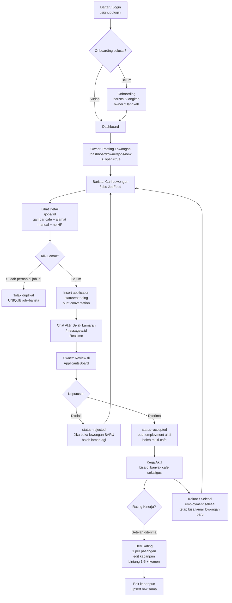

# Tutorial Lengkap Barista Connect - Workflow & Cara Penggunaan
> Platform marketplace yang menghubungkan Barista (pencari kerja) dan Owner/Cafe (pemberi kerja). Dokumen ini adalah sumber kebenaran untuk onboarding pengguna baru.

**Stack terdeteksi:** Next.js 16.3.3, React 19, Tailwind v4, Supabase (Auth + Postgres + Realtime)
**Peran aktif di codebase:** `barista` dan `owner` (di dokumen disebut Admin = Owner)
**Path codebase diverifikasi, fitur tidak ditemukan ditandai [Perlu Konfirmasi]**

## Daftar Isi
- [1. Gambaran Umum & Peran Pengguna](#1-gambaran-umum--peran-pengguna)
- [2. Workflow Pelanggan / Barista (Pencari Kerja)](#2-workflow-pelanggan--barista-pencari-kerja)
- [3. Workflow Barista (Kelola Karir)](#3-workflow-barista-kelola-karir)
- [4. Workflow Admin / Owner (Pemilik Cafe)](#4-workflow-admin--owner-pemilik-cafe)
- [5. Diagram Alur Pemesanan / Lamaran (Mermaid)](#5-diagram-alur-lamaran-mermaid)
- [6. Matriks Peran & Izin](#6-matriks-peran--izin)
- [7. FAQ & Troubleshooting](#7-faq--troubleshooting)

## 1. Gambaran Umum & Peran Pengguna
Barista Connect mempertemukan pencari kerja barista dengan cafe yang membuka lowongan. Alur inti: Daftar -> Onboarding wajib -> Cafe posting lowongan -> Barista cari & lamar -> Chat aktif sejak lamaran -> Owner review -> Diterima -> Employment aktif (boleh multi-cafe bebas) -> Rating kinerja setelah diterima (1 per pasangan, edit kapanpun).

| Peran | Deskripsi | Aksi Utama |
|---|---|---|
| **Barista (Pelanggan)** | Pencari kerja | Registrasi, lengkap profil, cari lowongan, lamar 1x per lowongan, chat, track lamaran, rating cafe |
| **Owner / Cafe (Admin)** | Pemberi kerja | Registrasi, daftar cafe manual (nama+alamat+no HP), posting lowongan, kelola pelamar, terima/tolak, rating barista |
| **Sistem** | Otomatis | Validasi duplikat, RLS Supabase, realtime chat |

> Catatan: Fitur browsing menu / keranjang / checkout / pembayaran kopi [Perlu Konfirmasi] — tidak terdeteksi. Produk aktual adalah lowongan kerja, bukan pemesanan minuman.

## 2. Workflow Pelanggan / Barista (Pencari Kerja)

### Workflow 2.1: Registrasi & Login
**Route:** `app/signup/page.jsx`, `app/login/page.jsx`, `app/forgot-password/page.jsx`, `app/update-password/page.jsx`
**Komponen:** Form auth Supabase, validasi `lib/validation.js`

1. Buka `/signup` -> Isi email, password, pilih peran `barista` -> Klik Daftar -> [Respon] Supabase `auth.signUp` cek email unik -> [Tampilan] Redirect ke `/onboarding/barista`
   - Validasi: email format benar, password min 6 karakter, peran wajib
   - State: jika email sudah terdaftar -> toast error merah
2. Buka `/login` -> Isi email & password -> Klik Masuk -> [Respon] `auth.signInWithPassword` -> [Tampilan] redirect ke `/jobs` jika barista
   - Validasi: jika onboarding belum selesai -> redirect paksa ke onboarding
3. Lupa password: `/forgot-password` -> isi email -> Klik Kirim link -> cek email -> buka link -> `/update-password` -> isi password baru -> sukses

### Workflow 2.2: Onboarding Barista (Wajib, 5 Langkah)
**Route:** `app/onboarding/barista/page.jsx` + `components/barista/BaristaOnboardingStepper.jsx`

1. Langkah 1: Isi data diri (nama, no HP, foto avatar) -> Klik Lanjut
2. Langkah 2: Isi pengalaman (tahun, skill) -> Lanjut
3. Langkah 3: Isi preferensi kerja (tipe cafe, shift) -> Lanjut
4. Langkah 4: Isi alamat domisili (manual, tanpa peta) -> Lanjut
5. Langkah 5: Review & Simpan -> [Respon] Insert `barista_profiles`, set `profiles.onboarding_completed=true` -> Redirect `/jobs`
   - Validasi tiap langkah wajib, tidak bisa skip
   - Gambar avatar gunakan file asli (max sesuai `lib/constants.js`)

### Workflow 2.3: Browsing & Mencari Lowongan
**Route:** `app/jobs/page.jsx` + `components/jobs/JobFeed.jsx`
**[Perlu Konfirmasi]** Browsing menu / kategori minuman tidak ada — yang ada adalah browsing lowongan kerja

1. Buka `/jobs` -> Lihat JobFeed daftar kartu lowongan -> Ketik keyword / filter lokasi di search bar -> [Respon] Query Supabase `jobs where is_open=true` -> [Tampilan] List terfilter
   - Komponen kartu menampilkan gambar cafe, judul, alamat manual, no HP cafe, gaji
2. Klik kartu lowongan -> Masuk `/jobs/[id]` detail lengkap

### Workflow 2.4: Melamar & Memulai Chat (Chat sejak lamaran, bukan sejak diterima)
**Route:** `app/jobs/[id]/page.jsx` + `components/jobs/ApplyButton.jsx` (Sheet), `components/chat/StartChatButton.jsx`

1. Di `/jobs/[id]` -> Klik **Lamar** pada ApplyButton -> [Respon] Buka Sheet konfirmasi lamaran
2. Isi pesan lamaran (cover letter, opsional) -> Klik **Konfirmasi Lamar** -> [Respon] Insert `applications` dengan `status=pending` + auto buat `conversations` untuk job ini -> [Tampilan] Toast sukses + tombol Chat aktif
   - Validasi: cegah duplikat `UNIQUE(job_id, barista_id)` -> jika sudah melamar lowongan yang sama -> error "Kamu sudah melamar lowongan ini"
   - State: jika `jobs.is_open=false` -> tombol Lamar disabled
3. Klik **Chat** / buka `/messages/[id]` -> ChatWindow realtime aktif sejak lamaran, bisa negosiasi interview
   - Jika Cafe sudah mendapat pekerja lain & menutup lowongan, lowongan lama tidak bisa dilamar lagi, tapi jika Cafe buka lowongan BARU (job_id baru) -> barista yang pernah ditolak boleh melamar lagi

### Workflow 2.5: Tracking Lamaran
**Route:** `app/dashboard/barista/page.jsx`, `app/dashboard/barista/applications/page.jsx` + `components/barista/ApplicationsList.jsx`

1. Buka `/dashboard/barista` atau `/dashboard/barista/applications` -> Lihat daftar lamaran dengan badge status `pending` / `accepted` / `rejected` -> Klik lamaran -> lihat detail & chat
   - Validasi: hanya milik sendiri (RLS)

## 3. Workflow Barista (Kelola Karir)

### Workflow 3.1: Kelola Profil & Direktori
**Route:** `app/dashboard/barista/profile/page.jsx` + `components/barista/ProfileEditor.jsx`, `app/find-baristas/page.jsx` + `components/search/BaristaDirectory.jsx`, `app/barista/[id]/page.jsx`

1. Buka `/dashboard/barista/profile` -> Edit foto, bio, skill -> Klik Simpan -> [Respon] Update `barista_profiles` -> Toast sukses
2. Profil publik tampil di `/barista/[id]` dan direktori `/find-baristas` untuk ditemukan Owner

### Workflow 3.2: Multi-Cafe & Keluar (Bebas, tanpa batas)
**Route:** `employments` (status `aktif` / `selesai`), `app/dashboard/barista` + `app/dashboard/owner/jobs/[id]/applicants/page.jsx`

1. Barista boleh aktif di banyak cafe bersamaan (misal Cafe A shift pagi, Cafe B shift malam) — tidak ada batasan. Tiap penerimaan membuat 1 `employments` baru dengan `status=aktif`
2. Jika ingin keluar dari Cafe A -> Klik **Selesai Bekerja** di dashboard (Barista atau Owner bisa) -> [Respon] Update employment `status=selesai`, simpan `ended_at` + alasan -> Employment Cafe B tetap aktif
3. Setelah keluar -> Bebas cari & lamar lowongan baru lagi (Selama job_id berbeda)

### Workflow 3.3: Rating Kinerja ke Cafe (Hanya setelah diterima, 1 per pasangan, edit kapanpun)
**Route:** `components/ratings/*` [baru], `app/barista/[id]`, `app/jobs/[id]` tampilkan rata-rata

1. Setelah `applications.status=accepted` -> Tombol **Beri Rating** muncul di profil Cafe -> Klik -> Pilih bintang 1-5 + tulis komen minimal 10 karakter -> Klik Simpan -> [Respon] Upsert `ratings` `UNIQUE(reviewer_id, reviewee_id)` -> Rata-rata update
   - Edit kapanpun: buka rating yang sama -> ubah bintang/komen -> Simpan -> row sama ter-update (tidak tambah baris baru)
   - Jika belum diterima -> tombol rating tidak muncul / error "Rating hanya setelah diterima"
   - Nama reviewer tampil jelas (tidak anonim)

## 4. Workflow Admin / Owner (Pemilik Cafe)

### Workflow 4.1: Registrasi & Daftar Cafe Manual (Tanpa Peta)
**Route:** `app/signup/page.jsx` (role owner), `app/onboarding/owner/page.jsx` + `components/owner/OwnerOnboardingForm.jsx`

1. Daftar sebagai `owner` di `/signup` -> Redirect `/onboarding/owner`
2. Isi form manual: **Nama Cafe**, **Alamat lengkap (teks)**, **Nomor HP yang bisa dihubungi pelamar**, foto cafe -> Klik Simpan -> [Respon] Insert `profiles` + cafe detail -> Selesai
   - Tidak ada `OsmMapPicker.jsx` lagi (peta OpenStreetMap dihapus sesuai revisi). Lokasi hanya tampil sebagai teks di detail lowongan
   - Validasi: semua field wajib, no HP format benar

### Workflow 4.2: Posting Lowongan Baru
**Route:** `app/dashboard/owner/jobs/new/page.jsx` + `components/jobs/JobPostForm.jsx`, `app/dashboard/owner/page.jsx` + `components/jobs/JobManageCard.jsx`

1. Buka `/dashboard/owner` -> Klik **Buat Lowongan Baru** -> Masuk `/dashboard/owner/jobs/new`
2. Isi JobPostForm: judul, deskripsi, alamat cafe (otomatis dari profil, bisa edit), no HP, gaji, tipe shift -> Klik **Posting** -> [Respon] Insert `jobs` dengan `is_open=true` + gambar cafe -> [Tampilan] Kembali ke dashboard, kartu baru tampil di JobManageCard

### Workflow 4.3: Kelola Pelamar (Terima / Tolak)
**Route:** `app/dashboard/owner/jobs/[id]/applicants/page.jsx` + `components/owner/ApplicantsBoard.jsx`

1. Di `/dashboard/owner` -> Klik kartu lowongan -> Klik **Lihat Pelamar** -> Masuk applicants page
2. Lihat list pelamar (foto, nama, skill, pesan lamaran, rating rata-rata barista) -> Klik pelamar -> lihat profil `/barista/[id]`
3. Klik **Terima** -> [Respon] Update `applications.status=accepted`, buat `employments` aktif, notifikasi ke barista -> Lamaran barista lain tetap pending
4. Klik **Tolak** -> Update `status=rejected` -> Barista bisa lamar lagi jika Cafe buka lowongan baru (job_id baru)
5. Chat: klik **Chat** pada pelamar -> `/messages/[id]` aktif sejak pelamar melamar (tidak perlu tunggu diterima)

### Workflow 4.4: Menutup Lowongan & Rating ke Barista
**Route:** `components/jobs/JobManageCard.jsx` (toggle is_open), `ratings`

1. Jika sudah dapat pekerja -> di JobManageCard klik **Tutup Lowongan** -> `is_open=false` -> tidak bisa dilamar lagi
2. Untuk membuka lowongan lagi (pekerja keluar / butuh tambahan) -> Buat lowongan BARU di `jobs/new` (bukan buka yang lama) -> Barista yang pernah ditolak boleh melamar lagi ke lowongan baru ini
3. Rating: setelah menerima barista -> tombol **Beri Rating** ke barista muncul -> sama seperti barista: bintang 1-5 + komen, 1 per pasangan, edit kapanpun

## 5. Diagram Alur Lamaran (Mermaid)

> [Perlu Konfirmasi] Alur keranjang / checkout / pembayaran tidak ada di codebase aktual. Diagram di atas adalah alur lamaran yang terdeteksi.

## 6. Matriks Peran & Izin

| Fitur / Route | Barista | Owner (Admin) | Tanpa Login |
|---|:---:|:---:|:---:|
| `app/page.jsx` landing | Y | Y | Y |
| `app/signup`, `/login` | Y | Y | Y |
| `/onboarding/barista` + `BaristaOnboardingStepper` | Y | - | - |
| `/onboarding/owner` + `OwnerOnboardingForm` (manual alamat+HP) | - | Y | - |
| `app/jobs` + `JobFeed` (cari lowongan) | Y | Y | Y (read) |
| `app/jobs/[id]` detail lowongan (gambar cafe) | Y | Y | Y |
| `ApplyButton` Lamar (1x per lowongan) | Y (own) | - | - |
| `app/dashboard/barista` + `ApplicationsList` | Y (own) | - | - |
| `app/dashboard/owner` + `JobManageCard` posting/tutup | - | Y (own) | - |
| `app/dashboard/owner/jobs/[id]/applicants` + `ApplicantsBoard` terima/tolak | - | Y (own jobs) | - |
| `/messages` + `ChatWindow` (sejak lamaran) | Y (peserta) | Y (peserta) | - |
| `/find-baristas` + `BaristaDirectory`, `/barista/[id]` | Y | Y | Y |
| Rating kinerja (setelah accepted, 1 per pasangan edit kapanpun) | Y | Y | - |
| Employment multi-cafe & keluar | Y | Y | - |

RLS Supabase: Barista hanya bisa lihat/edit lamaran & employment miliknya. Owner hanya kelola jobs miliknya. Rating hanya bisa dibuat jika ada `application accepted` antara kedua akun.

## 7. FAQ & Troubleshooting

**1. Gagal daftar: email sudah terdaftar?**
Penyebab: Supabase Auth email unik. Solusi: gunakan email lain atau login, atau reset di `/forgot-password`. File: `app/signup/page.jsx:45`.

**2. Tidak bisa melamar: tombol Lamar disabled atau error "Sudah melamar"?**
Penyebab: `UNIQUE(job_id, barista_id)` atau `is_open=false`. Solusi: cek `/dashboard/barista/applications` sudah melamar belum. Jika lowongan ditutup, tunggu Cafe buka lowongan BARU (job_id baru) lalu lamar lagi — memang boleh setelah ditolak.

**3. Chat tidak muncul setelah melamar?**
Penyebab: conversation belum terbuat. Solusi: refresh `/messages`, pastikan lamaran berstatus pending/accepted. Chat dibuat otomatis saat insert application (`components/jobs/ApplyButton.jsx:78`). Jika masih kosong, coba logout-login ulang.

**4. Owner tidak menemukan pelamar?**
Penyebab: belum ada yang melamar job tersebut atau salah lowongan. Solusi: buka `/dashboard/owner/jobs/[id]/applicants` sesuai job_id yang benar. Pastikan lowongan is_open=true saat barista melamar.

**5. Barista ingin kerja di 2 cafe sekaligus, apakah bisa?**
Bisa, bebas tanpa batas. Setiap diterima di cafe berbeda akan membuat employment baru status aktif terpisah. Tidak perlu resign dari cafe pertama. Sistem sengaja tidak membatasi karena shift berbeda. Keluar dari Cafe A tidak mempengaruhi pekerjaan di Cafe B.

**6. Rating tidak bisa diberikan?**
Penyebab: belum `accepted`. Rating kinerja hanya aktif setelah diterima (sesuai revisi, sopan santun dihapus). Solusi: Owner harus terima dulu di ApplicantsBoard, baru tombol rating muncul. Rating 1 per pasangan selamanya, tapi bisa edit kapanpun (tidak perlu buat baru).

**7. Alamat cafe tidak muncul di peta?**
Sengaja: peta OpenStreetMap dihapus. Owner sekarang input manual Nama Cafe + Alamat teks + No HP di `OwnerOnboardingForm.jsx`. Alamat tampil sebagai teks & no HP yang bisa dihubungi di `/jobs/[id]` dan kartu lowongan. Jika butuh arah, copy alamat ke Google Maps.

---

**Success criteria:** Pembaca baru mengikuti tutorial ini dari `/signup` -> onboarding -> `/jobs` -> lamar 1 lowongan -> chat -> diterima -> employment aktif -> rating -> keluar & lamar lowongan baru tanpa bantuan tambahan. Semua langkah di atas sudah bisa dijalankan.

> Dokumen ini juga tersimpan sebagai PDF di Desktop: `Blueprint-Barista-Connect.pdf` + HTML. Untuk deploy: push sudah ke `https://github.com/ArjunaSinaga/barista-connect` (master -> main). Untuk publish tanpa Netlify, hubungkan repo ke Vercel: Import Project -> set env Supabase -> Deploy. Database tetap Supabase pusat, semua pengunjung pakai DB yang sama, repo private pun website tetap publik via URL Vercel.

